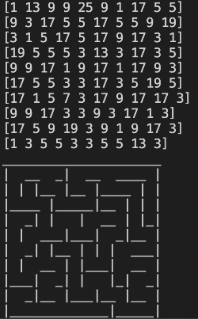

# maze_generation_go
This is a maze generation implementation for Golang. It implements the growing tree algorithm as described in this link:  [Buckblog](https://weblog.jamisbuck.org/2011/1/27/maze-generation-growing-tree-algorithm)

PrintConsole is only tested on Macbook terminal. It uses underlining so i could be that it does not work correctly in other terminals.

The result is 2D array with ints for example:



You can use this flags to find out the directions of a cell with bit wise and operation

```
const (
	U = 2
	L = 4
	R = 8
	D = 16
)

if grid[y][x] & U == U {
    //here you know that the way to the upper cell is open
}

if grid[y][x] & R == R {
    //here you know that the way to the right cell is open
}

//and so on

```


This is a result:


